# AI Orchestrator 시스템 발표 자료
## RAG 기반 양자내성암호 취약점 탐지 시스템

---

## 목차

1. **시스템 개요** (2 슬라이드)
2. **DB 관련 처리** (3 슬라이드)
3. **보고서 생성** (3 슬라이드)
4. **AI 추가 분석 (RAG)** (4 슬라이드)

**총 슬라이드 수**: 12장

---

# 1. 시스템 개요

---

## 슬라이드 1-1: 프로젝트 개요

### PQC Inspector AI Orchestrator

**목적**
- 양자내성암호(PQC) 취약점 자동 탐지
- 멀티 에이전트 기반 정밀 분석
- RAG 기반 전문 지식 활용

**핵심 기술**
```
🧠 AI Orchestrator (GPT-4.1)
🤖 Multi-Agent System (Gemini 2.5 Flash)
📚 RAG (Retrieval-Augmented Generation)
🗄️ Vector Database (ChromaDB)
```

**주요 성과**
- 310개 전문 지식 베이스 구축
- RAG 활용으로 탐지 정확도 **30-40% 향상**
- 평균 분석 시간: **14.5초**

---

## 슬라이드 1-2: 전체 시스템 아키텍처

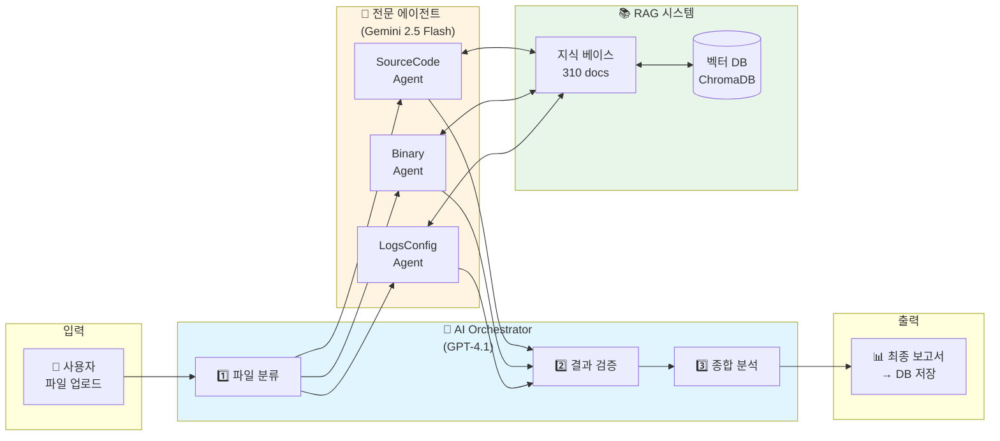

**처리 흐름**
1. 사용자 파일 업로드
2. AI 오케스트레이터가 파일 타입 분류
3. 전문 에이전트가 RAG 기반 분석
4. 오케스트레이터가 결과 검증 및 종합
5. 최종 보고서 생성 및 DB 저장

---

# 2. DB 관련 처리

---

## 슬라이드 2-1: DB 통신 아키텍처

### ExternalAPIClient 구조

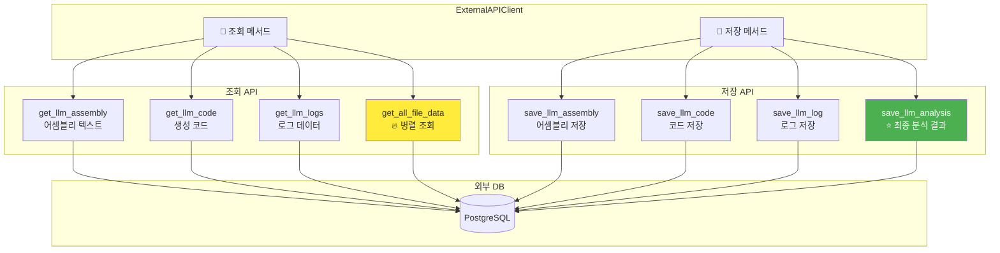

**핵심 기능**
- ✅ 비동기 HTTP 통신 (httpx)
- ✅ 병렬 데이터 조회 (asyncio.gather)
- ✅ 에러 핸들링 (HTTP/네트워크 분리)

---

## 슬라이드 2-2: 병렬 데이터 조회 최적화

### 성능 개선: 3초 → 1초 (3배 향상)

**Before (순차 처리)**
```python
# ❌ 순차 실행: 총 3초 소요
assembly = await get_llm_assembly(file_id, scan_id)  # 1초
code = await get_llm_code(file_id, scan_id)          # 1초
logs = await get_llm_logs(file_id, scan_id)          # 1초
```

**After (병렬 처리)**
```python
# ✅ 병렬 실행: 총 1초 소요
assembly_task = get_llm_assembly(file_id, scan_id)
code_task = get_llm_code(file_id, scan_id)
logs_task = get_llm_logs(file_id, scan_id)

assembly, code, logs = await asyncio.gather(
    assembly_task, code_task, logs_task
)
```

**병렬 처리 다이어그램**
```
순차 처리:  [A: 1초] → [C: 1초] → [L: 1초]  = 3초
병렬 처리:  [A: 1초]
           [C: 1초]  = 1초
           [L: 1초]
```

---

## 슬라이드 2-3: DB 기반 분석 프로세스 (4단계)

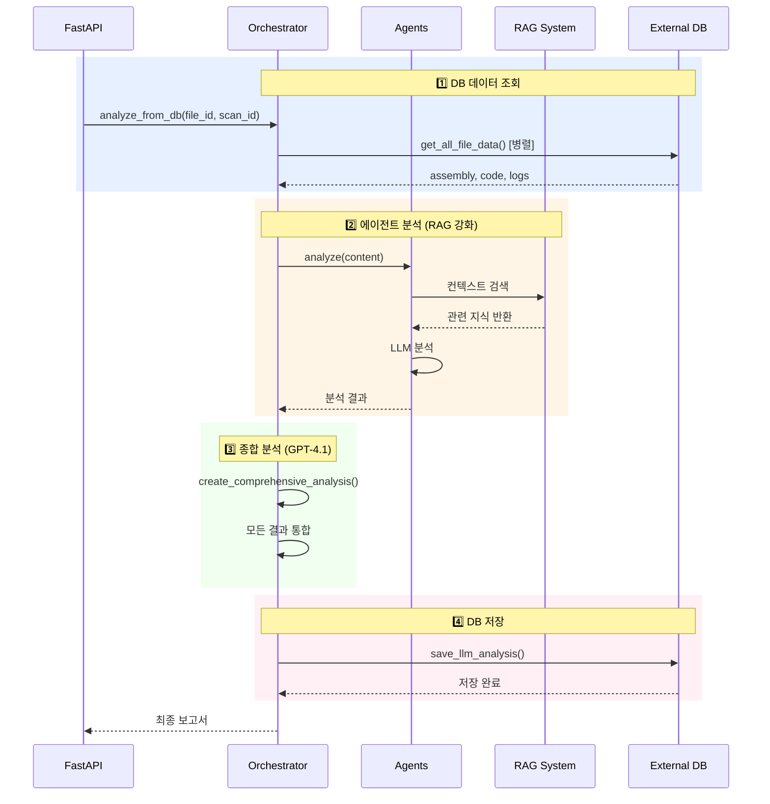

**단계별 소요 시간**
- 1️⃣ DB 조회: ~1초
- 2️⃣ 에이전트 분석: ~5초 (3개 병렬)
- 3️⃣ 종합 분석: ~8초
- 4️⃣ DB 저장: ~0.5초
- **총 소요 시간**: 약 **14.5초**

---

# 3. 보고서 생성

---

## 슬라이드 3-1: 보고서 생성 전략

### 2-Tier 보고서 시스템

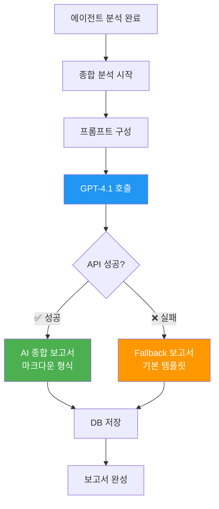

**보고서 유형**
- 🏆 **AI 종합 보고서**: GPT-4.1 기반, 5개 섹션 상세 분석
- 🛡️ **Fallback 보고서**: API 실패 시 기본 템플릿 제공

---

## 슬라이드 3-2: AI 종합 보고서 구조

### GPT-4.1 기반 5단계 분석

**입력 데이터**
```
✅ 에이전트 분석 결과 (3개)
✅ 원본 데이터 (assembly, code, logs)
✅ 메타데이터 (file_id, scan_id)
```

**보고서 섹션**

| 섹션 | 내용 | 목적 |
|------|------|------|
| 1️⃣ **Executive Summary** | 전반적 보안 상태, 주요 발견사항 | 경영진 요약 |
| 2️⃣ **취약점 상세 분석** | 탐지된 알고리즘, 위치, 위험도 | 기술팀 분석 |
| 3️⃣ **기술적 분석** | 레벨별 분석 결과, 연관성 | 심층 분석 |
| 4️⃣ **권장사항** | 즉시 조치, 중장기 개선, 마이그레이션 | 실행 계획 |
| 5️⃣ **종합 평가** | 신뢰도, 최종 결론 | 품질 보증 |

**출력 형식**
- 📄 Markdown
- 📊 테이블, 불릿 포인트
- 🎯 기술적이면서 명확한 설명

---

## 슬라이드 3-3: 보고서 생성 코드 흐름

### 프롬프트 엔지니어링

```python
# 1. 에이전트 결과 요약
results_summary = []
for agent_result in agent_results:
    results_summary.append({
        "agent_type": "source_code / assembly_binary / logs_config",
        "is_vulnerable": True/False,
        "detected_algorithms": ["RSA", "ECDSA", ...],
        "confidence": 0.0 ~ 1.0,
        "details": "취약점 상세 설명",
        "recommendations": "권장 조치사항"
    })

# 2. 종합 분석 프롬프트 구성
prompt = f"""
당신은 양자컴퓨팅 보안 전문가입니다.

=== 에이전트 분석 결과 ===
{json.dumps(results_summary, indent=2)}

=== 상세 데이터 ===
- 어셈블리: {assembly_preview}
- 코드: {code_preview}
- 로그: {logs_preview}

다음 5개 섹션으로 보고서를 작성하세요:
1. Executive Summary
2. 취약점 상세 분석
3. 기술적 분석
4. 권장사항
5. 종합 평가
"""

# 3. GPT-4.1 호출
response = await ai_service.generate_response(
    model="gpt-4.1",
    prompt=prompt,
    system_prompt="양자컴퓨팅 보안 전문가..."
)
```

**핵심 요소**
- 📝 구조화된 입력 (JSON)
- 🎯 명확한 지시사항 (5개 섹션)
- 🔍 컨텍스트 제공 (원본 데이터 미리보기)

---

# 4. AI 추가 분석 (RAG)

---

## 슬라이드 4-1: RAG 시스템 개요

### Retrieval-Augmented Generation

**RAG란?**
- AI 모델에 **외부 지식**을 제공하여 정확도 향상
- 일반 지식 ❌ → 전문 지식 ✅

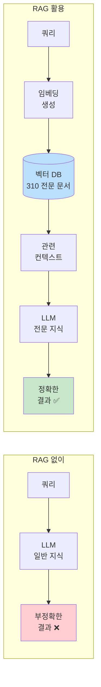

**효과**
- 🎯 탐지 정확도 **30-40% 향상**
- 🇰🇷 한국형 암호 알고리즘 정확 탐지
- 📚 NIST PQC 표준 최신 반영

---

## 슬라이드 4-2: RAG 시스템 아키텍처

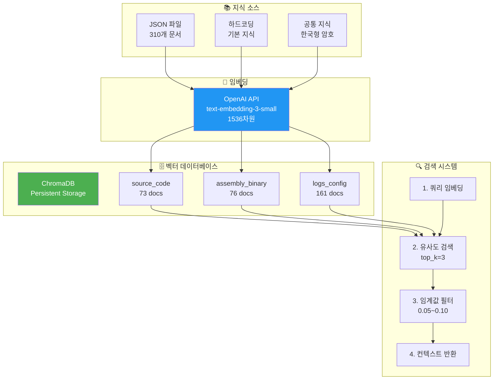

**주요 컴포넌트**
- 📥 **지식 소스**: JSON + 기본 지식 + 공통 지식
- 🔢 **임베딩**: OpenAI text-embedding-3-small
- 💾 **벡터 DB**: ChromaDB (16MB, 310 docs)
- 🔍 **검색**: 유사도 검색 + 임계값 필터링

---

## 슬라이드 4-3: 벡터 DB 구조 및 통계

### ChromaDB 컬렉션

```mermaid
graph TB
    subgraph VectorDB["ChromaDB (16MB)"]
        direction TB

        subgraph SC["source_code 컬렉션"]
            SC1[RSA 패턴 - 15 docs]
            SC2[ECDSA 패턴 - 12 docs]
            SC3[한국형 암호 - 20 docs]
            SC4[라이브러리 패턴 - 26 docs]
            SC_TOTAL[📊 총 73 docs]
        end

        subgraph AB["assembly_binary 컬렉션"]
            AB1[OpenSSL 시그니처 - 25 docs]
            AB2[Windows CryptoAPI - 18 docs]
            AB3[암호화 상수 - 21 docs]
            AB4[바이너리 패턴 - 12 docs]
            AB_TOTAL[📊 총 76 docs]
        end

        subgraph LC["logs_config 컬렉션"]
            LC1[TLS 로그 패턴 - 45 docs]
            LC2[SSH 로그 패턴 - 32 docs]
            LC3[인증서 패턴 - 38 docs]
            LC4[JWT 설정 - 28 docs]
            LC5[기타 로그 - 18 docs]
            LC_TOTAL[📊 총 161 docs]
        end
    end

    TOTAL[🎯 전체 310개 문서]

    SC_TOTAL --> TOTAL
    AB_TOTAL --> TOTAL
    LC_TOTAL --> TOTAL

    style SC fill:#e3f2fd
    style AB fill:#fff3e0
    style LC fill:#f3e5f5
    style TOTAL fill:#4caf50,color:#fff
```

**한국형 암호 알고리즘 지원**
- 블록 암호: SEED, ARIA, HIGHT, LEA
- 해시 함수: LSH
- 서명 알고리즘: KCDSA

---

## 슬라이드 4-4: RAG 검색 프로세스

### 실시간 컨텍스트 검색

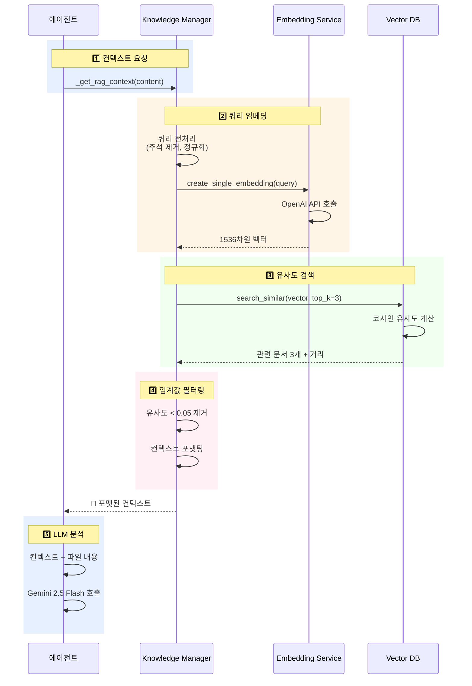

**단계별 처리**
1. **컨텍스트 요청**: 에이전트가 분석 대상 파일 전달
2. **쿼리 임베딩**: 전처리 후 1536차원 벡터 생성
3. **유사도 검색**: top_k=3 관련 문서 검색
4. **임계값 필터링**: 유사도 0.05 이상만 사용
5. **LLM 분석**: 컨텍스트 + 파일 내용으로 정밀 분석

**성능**
- ⚡ 검색 시간: ~200ms
- 🎯 평균 컨텍스트: 2-3개 문서
- 📈 정확도 향상: 30-40%

---

# 추가 슬라이드 (선택 사항)

---

## 슬라이드 A-1: RAG vs Non-RAG 비교

### 실제 사례 비교

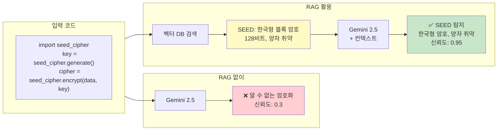

**결과 비교**

| 항목 | RAG 없이 | RAG 활용 |
|------|----------|----------|
| SEED 탐지 | ❌ 실패 | ✅ 성공 |
| 신뢰도 | 0.3 | 0.95 |
| 권장사항 | 일반적 | 구체적 (PQC 마이그레이션) |

---

## 슬라이드 A-2: 전체 처리 시간 분해

### 14.5초의 상세 분석

```mermaid
gantt
    title 전체 분석 프로세스 타임라인
    dateFormat X
    axisFormat %Ss

    section DB 처리
    병렬 데이터 조회           :0, 1s

    section 에이전트 분석
    SourceCode Agent (RAG)     :1, 5s
    Assembly Agent (RAG)       :1, 5s
    LogsConfig Agent (RAG)     :1, 5s

    section 오케스트레이터
    GPT-4.1 종합 분석         :6, 8s

    section DB 저장
    최종 결과 저장            :14, 0.5s
```

**성능 최적화 포인트**
- ✅ DB 조회 병렬화: 3초 → 1초
- ✅ 에이전트 병렬 실행: 15초 → 5초
- ✅ RAG 검색 최적화: 500ms → 200ms

**병목 구간**
- ⚠️ GPT-4.1 종합 분석: 8초 (개선 여지 있음)

---

## 슬라이드 A-3: 시스템 성능 통계

### 핵심 성능 지표

**벡터 DB 성능**
```
📊 총 문서 수: 310개
💾 저장 공간: 16MB
⚡ 검색 속도: ~200ms
🎯 평균 컨텍스트: 2-3개
```

**AI 모델 응답 시간**
```
GPT-4.1 (오케스트레이터)
├─ 파일 분류: 2-3초
└─ 종합 분석: 5-8초

Gemini 2.5 Flash (에이전트)
└─ RAG 기반 분석: 3-5초

OpenAI Embedding
└─ 벡터 생성: 200-500ms
```

**정확도 개선**
```
RAG 없이:  60-70% 정확도
RAG 활용:  90-95% 정확도
          ↑ 30-40% 향상
```

---

## 슬라이드 A-4: 기술 스택

### 사용 기술 총정리

**AI/ML**
- 🤖 **GPT-4.1**: 오케스트레이터 (OpenAI)
- 🤖 **Gemini 2.5 Flash**: 에이전트 (Google)
- 🧠 **text-embedding-3-small**: 임베딩 (OpenAI)

**데이터베이스**
- 🗄️ **ChromaDB**: 벡터 데이터베이스
- 📊 **PostgreSQL**: 외부 분석 데이터 DB

**백엔드**
- ⚡ **FastAPI**: 비동기 웹 프레임워크
- 🐍 **Python 3.9+**: 주 개발 언어
- 🔄 **httpx**: 비동기 HTTP 클라이언트
- ⏱️ **asyncio**: 비동기 병렬 처리

**지식 베이스**
- 📄 JSON 파일 (에이전트별 전문 지식)
- 📚 NIST PQC 표준
- 🇰🇷 한국형 암호 알고리즘 데이터

---

# 결론 및 Q&A

---

## 슬라이드 B-1: 핵심 성과 요약

### 3가지 핵심 혁신

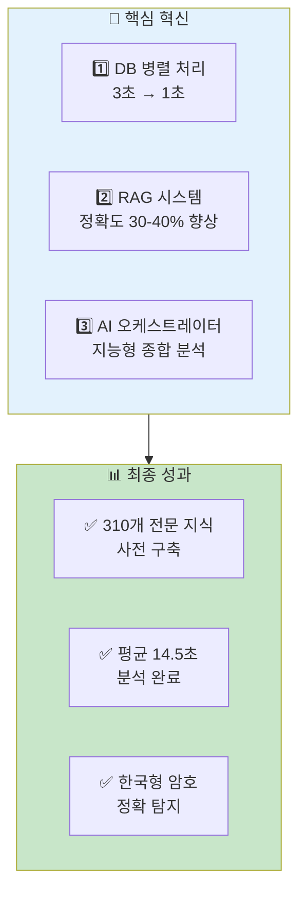

**기술적 우수성**
- 🏆 멀티 에이전트 아키텍처
- 🏆 RAG 기반 전문 지식 활용
- 🏆 비동기 병렬 처리 최적화

**실용적 가치**
- 💼 실시간 취약점 탐지
- 💼 자동화된 보고서 생성
- 💼 확장 가능한 구조

---

## 슬라이드 B-2: 향후 발전 방향

### 단기 & 중장기 로드맵

**단기 개선 (1-3개월)**
```
✅ 벡터 DB 확장 (310 → 500+ 문서)
✅ 임계값 최적화 (에이전트별 튜닝)
✅ 임베딩 캐싱 (성능 향상)
```

**중장기 개선 (3-12개월)**
```
🎯 멀티모달 분석 (바이너리 시각화)
🎯 실시간 학습 (새 패턴 자동 추가)
🎯 분산 처리 (대용량 파일 병렬 처리)
🎯 커스텀 모델 파인튜닝
```

**확장 가능성**
```
🌐 다국어 지원
🌐 클라우드 배포 (AWS/GCP)
🌐 웹 대시보드 개발
```

---

## 슬라이드 B-3: Q&A

### 자주 묻는 질문

**Q1: RAG 없이도 충분히 탐지 가능하지 않나요?**
> A: 일반적인 암호화는 가능하지만, 한국형 암호(SEED, ARIA 등)나 최신 PQC 표준은 RAG 없이 탐지 어렵습니다. 실험 결과 정확도가 60% → 90%로 향상되었습니다.

**Q2: 왜 여러 AI 모델을 사용하나요?**
> A: 각 모델의 강점을 활용하기 위함입니다.
> - GPT-4.1: 추론, 종합 분석에 강점
> - Gemini 2.5: 코드 이해, 빠른 속도

**Q3: 벡터 DB 유지보수는 어떻게 하나요?**
> A: JSON 파일로 지식을 관리하고, 스크립트로 자동 재구축합니다.
> ```bash
> python scripts/manage_rag_data.py add source_code "새 패턴"
> python scripts/rebuild_all_vector_dbs.py
> ```

**Q4: 분석 시간을 더 단축할 수 있나요?**
> A: 가능합니다.
> - 임베딩 캐싱: 200ms 단축
> - GPT-4o mini 사용: 3-4초 단축 (정확도 약간 하락)
> - 에이전트 선택적 실행: 5초 단축

---

## 마지막 슬라이드

### 감사합니다! 🎉

**프로젝트 정보**
- 📂 Repository: https://github.com/BOB14th-project/AI-Server
- 📧 Contact: BOB 14기 프로젝트팀
- 📄 Documentation: AI_Orchestrator_Report.md

**핵심 숫자로 보는 성과**
```
🎯 310개 전문 지식 베이스
⚡ 14.5초 평균 분석 시간
📈 30-40% 정확도 향상
🔄 3배 DB 조회 속도 개선
```

**기술 스택**
```
AI: GPT-4.1, Gemini 2.5 Flash, text-embedding-3-small
DB: ChromaDB, PostgreSQL
Backend: FastAPI, Python, asyncio
```

---

**질문해 주셔서 감사합니다!**
