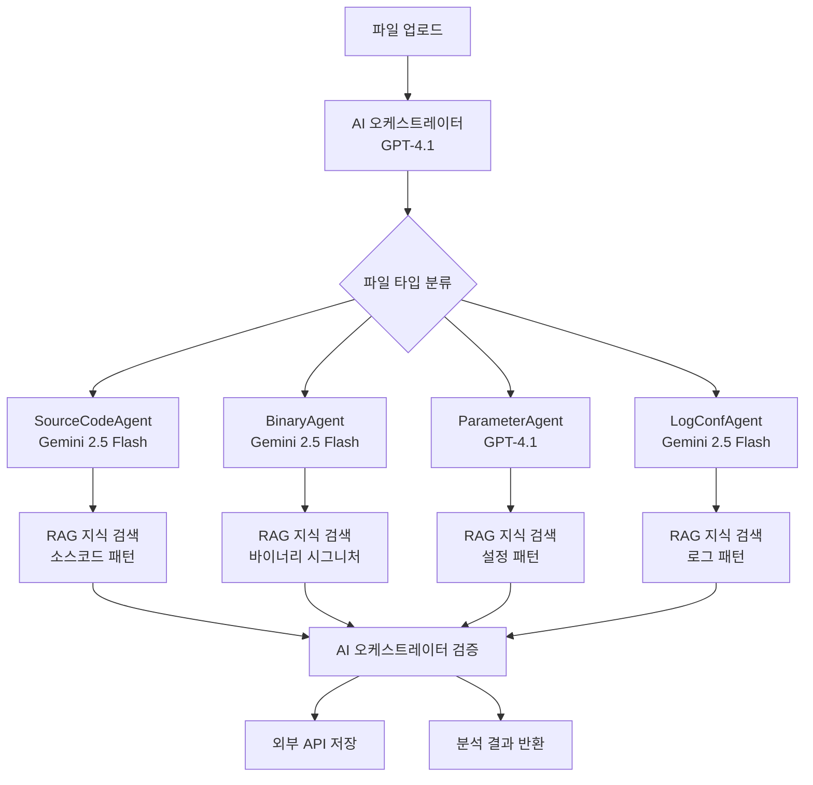

# 📖 PQC Inspector AI

양자내성암호(PQC) 전환을 돕기 위해 소스코드, 바이너리, 설정 파일 등에서 비양자내성암호(Non-PQC) 사용 여부를 탐지하는 **RAG 강화 AI 기반 분석 시스템**입니다.

## ✨ 주요 기능

### 🧠 AI 오케스트레이터
- **지능형 파일 분류**: 업로드된 파일의 종류를 AI가 자동으로 분석하여 적절한 전문 에이전트에 할당
- **결과 검증 및 요약**: 에이전트 분석 결과를 검토하고 최종 품질 보장
- **상용 AI API 활용**: GPT-4.1을 사용한 고성능 AI 처리

### 🤖 RAG 강화 전문 에이전트 시스템
- **SourceCodeAgent**: 프로그래밍 언어 소스코드 전문 분석 (Gemini 2.5 Flash + 전문 지식 베이스)
- **BinaryAgent**: 실행 파일 및 라이브러리 분석 (Gemini 2.5 Flash + 바이너리 시그니처 DB)
- **ParameterAgent**: 설정 파일 및 매개변수 분석 (GPT-4.1 + 설정 패턴 DB)
- **LogConfAgent**: 로그 파일 및 서버 설정 분석 (Gemini 2.5 Flash + 로그 패턴 DB)

### 📚 RAG (Retrieval-Augmented Generation) 시스템
- **벡터 데이터베이스**: ChromaDB를 활용한 고속 유사도 검색
- **전문 지식 베이스**: 에이전트별 특화된 암호화 패턴 및 취약점 정보
- **실시간 컨텍스트 검색**: 분석 중 관련 전문 지식을 자동으로 검색하여 정확도 향상
- **OpenAI 임베딩**: `text-embedding-3-small` 모델 사용

### 💾 외부 API 통합
- **데이터베이스 대신 외부 API 활용**: PostgreSQL 없이 경량화된 아키텍처
- **RESTful API 설계**: 다른 시스템과 쉽게 통합 가능
- **비동기 백그라운드 처리**: 대용량 파일 분석을 위한 효율적인 처리

## 🛠️ 시작하기

### 📋 사전 준비
- **Python 3.9+**
- **OpenAI API 키**: GPT-4.1 및 임베딩 API 사용
- **Google API 키**: Gemini 2.5 Flash API 사용
- **충분한 디스크 공간**: ChromaDB 벡터 데이터베이스 저장용

### 🚀 설치 및 실행

#### 1. 프로젝트 클론
```bash
git clone https://github.com/your-username/pqc-inspector.git
cd PQC-Inspector
```

#### 2. 환경 변수 설정
```bash
# .env 파일 생성
cp .env.example .env

# .env 파일 편집 (API 키 입력)
vim .env
```

`.env` 파일 예제:
```bash
# 상용 AI API 키
OPENAI_API_KEY="sk-proj-your-openai-key-here"
GOOGLE_API_KEY="your-google-api-key-here"

# 외부 API 설정 (선택사항)
EXTERNAL_API_BASE_URL="https://api.example.com/v1"
EXTERNAL_API_KEY="your-api-key-here"

# 로그 레벨
LOG_LEVEL="INFO"
```

#### 3. Python 환경 설정
```bash
python -m venv .venv
source .venv/bin/activate  # Windows: .venv\Scripts\activate
pip install -r requirements.txt
```

#### 4. RAG 지식 베이스 초기화 (자동)
서버 첫 실행 시 RAG 시스템이 자동으로 초기화됩니다:
- ChromaDB 벡터 데이터베이스 생성
- 기본 암호화 패턴 지식 베이스 로드
- 각 에이전트별 전문 지식 임베딩 생성

#### 5. 서버 실행
```bash
python main.py
```

#### 6. 접속 확인
- **로컬 접속**: http://127.0.0.1:8000
- **API 문서**: http://127.0.0.1:8000/docs
- **RAG 상태 확인**: 서버 로그에서 "지식 베이스 초기화 완료" 메시지 확인

### 📱 네트워크 공유 (핫스팟)

다른 사람이 API를 사용하려면:
1. **맥북에서 핫스팟 활성화**
2. **다른 기기를 핫스팟에 연결**
3. **맥북 IP 확인**: `ifconfig | grep "inet " | grep -v 127.0.0.1`
4. **접속**: `http://[맥북IP]:8000`

## 🏗️ 시스템 아키텍처



### 🔄 RAG 강화 분석 워크플로우
1. **파일 업로드** → AI 오케스트레이터(GPT-4.1)가 파일 내용과 확장자 분석
2. **파일 분류** → 적절한 전문 에이전트 선택 (source_code, binary, parameter, log_conf)
3. **RAG 컨텍스트 검색** → 벡터 DB에서 관련 전문 지식 검색 (top-3 유사도)
4. **강화된 분석** → 에이전트가 전문 지식을 활용하여 암호화 패턴 탐지
5. **결과 검증** → AI 오케스트레이터가 분석 결과 품질 검토 및 요약
6. **저장 및 반환** → 외부 API에 결과 저장 후 사용자에게 반환

## 📁 프로젝트 구조

```
PQC-Inspector/
├── main.py                          # 🚀 애플리케이션 진입점
├── requirements.txt                  # 📦 Python 의존성 (ChromaDB, httpx 등)
├── .env                             # 🔐 환경 변수 (API 키)
├── CLAUDE.md                        # 🤖 개발 가이드
├── README.md                        # 📖 프로젝트 문서
├── docs/
│   ├── rag-training-plan.md         # 🧠 RAG 시스템 훈련 계획
│   └── RAG_DATA_GUIDE.md           # 📚 RAG 데이터 관리 가이드
├── data/                            # 📂 데이터 디렉토리
│   ├── vector_db/                   # 🗄️ ChromaDB 벡터 데이터베이스
│   └── rag_knowledge_base/          # 📚 RAG 지식 베이스
│       ├── source_code/             # 💻 소스코드 전문 지식
│       ├── binary/                  # ⚡ 바이너리 전문 지식
│       ├── parameter/               # 📋 설정 파일 전문 지식
│       └── log_conf/                # 📝 로그 파일 전문 지식
├── test/                            # 🧪 테스트 파일들
│   ├── test_rsa.py                  # 기본 RSA 테스트
│   ├── test_hidden_crypto.py        # 숨겨진 암호화 테스트
│   └── test_stealth_crypto.c        # 고도로 위장된 C 암호화
└── pqc_inspector_server/
    ├── core/
    │   └── config.py                # ⚙️ 환경 설정 (API 키 관리)
    ├── api/
    │   ├── endpoints.py             # 🛣️ API 라우터
    │   └── schemas.py               # 📋 데이터 모델
    ├── db/
    │   └── api_client.py            # 🌐 외부 API 클라이언트
    ├── services/
    │   ├── ai_service.py            # 🤖 상용 AI API 서비스
    │   ├── embedding_service.py     # 🧠 임베딩 생성 서비스
    │   ├── vector_store.py          # 🗄️ 벡터 데이터베이스 서비스
    │   └── knowledge_manager.py     # 📚 지식 베이스 관리 서비스
    ├── agents/
    │   ├── base_agent.py            # 👤 RAG 강화 에이전트 기본 클래스
    │   ├── source_code.py           # 💻 소스코드 분석 에이전트
    │   ├── binary.py                # ⚡ 바이너리 분석 에이전트
    │   ├── parameter.py             # 📋 설정파일 분석 에이전트
    │   └── log_conf.py              # 📝 로그파일 분석 에이전트
    └── orchestrator/
        └── controller.py            # 🧠 AI 오케스트레이터 (GPT-4.1)
```

## 🌐 API 엔드포인트

### 📊 기본 엔드포인트
- **GET `/`**: 서버 상태 확인
- **GET `/docs`**: Swagger UI API 문서
- **GET `/redoc`**: ReDoc API 문서

### 🔍 분석 엔드포인트
- **POST `/api/v1/analyze`**: 파일 분석 요청
  ```bash
  curl -X POST "http://localhost:8000/api/v1/analyze" \
       -H "accept: application/json" \
       -H "Content-Type: multipart/form-data" \
       -F "file=@test/test_rsa.py"
  ```

- **GET `/api/v1/analyze/{task_id}`**: 분석 결과 조회
  ```bash
  curl -X GET "http://localhost:8000/api/v1/analyze/{task_id}"
  ```

### 📋 응답 형식
```json
{
  "task_id": "unique-task-identifier",
  "file_name": "test_rsa.py",
  "file_type": "source_code",
  "is_pqc_vulnerable": true,
  "vulnerability_details": "RSA 2048-bit encryption detected",
  "detected_algorithms": ["RSA"],
  "recommendations": "Replace with CRYSTALS-Kyber for quantum resistance",
  "evidence": "import rsa, rsa.newkeys(2048)",
  "confidence_score": 0.95,
  "orchestrator_summary": "High confidence RSA detection in Python code"
}
```

## 🧠 AI 모델 정보

| 역할 | 모델 | 용도 | RAG 지식 베이스 |
|------|------|------|----------------|
| 오케스트레이터 | GPT-4.1 | 파일 분류, 결과 검증 | - |
| 소스코드 분석 | Gemini 2.5 Flash | 프로그래밍 언어 코드 분석 | RSA/ECDSA/DSA 패턴, 라이브러리 시그니처 |
| 바이너리 분석 | Gemini 2.5 Flash | 실행파일 분석 | OpenSSL 시그니처, 암호화 상수 |
| 설정파일 분석 | GPT-4.1 | JSON, YAML, XML 등 분석 | JWT 알고리즘, TLS cipher suite |
| 로그파일 분석 | Gemini 2.5 Flash | 로그 및 구성파일 분석 | TLS 핸드셰이크, 인증서 패턴 |
| 임베딩 생성 | OpenAI text-embedding-3-small | 벡터 임베딩 생성 | - |

## 📚 RAG 시스템 사용법

### 🧠 RAG 시스템이란?

RAG(Retrieval-Augmented Generation)는 AI 모델이 분석 시 관련 전문 지식을 실시간으로 검색하여 활용하는 시스템입니다. PQC Inspector는 각 에이전트별로 특화된 지식 베이스를 유지합니다.

### 📈 RAG의 장점

- **정확도 향상**: 전문 지식 기반으로 오탐율 감소
- **최신성**: 새로운 암호화 패턴을 쉽게 추가 가능
- **설명 가능성**: 어떤 지식을 참조했는지 추적 가능
- **적응성**: 에이전트별 특화된 분석 능력

### 🔧 지식 추가 방법

#### 📝 JSON 패턴 추가
```bash
# JSON 파일로 패턴 추가
vim data/rag_knowledge_base/source_code/my_patterns.json
python main.py  # 서버 재시작으로 자동 로드
```

#### 📄 공식 문서 추가 (PDF, DOCX 등)
```bash
# 단일 PDF 문서 추가
python scripts/ingest_documents.py file data/documents/nist-pqc-standard.pdf

# 디렉토리 전체 문서 추가
python scripts/ingest_documents.py directory data/documents/

# 여러 문서 배치 추가
python scripts/ingest_documents.py batch file1.pdf file2.docx file3.md
```

#### 🔧 동적 지식 추가
```bash
# 실시간 지식 추가
python scripts/manage_rag_data.py add source_code "새로운 암호화 패턴 설명"
```

### 📋 JSON 데이터 형식 예시

```json
{
  "patterns": [
    {
      "type": "crypto_pattern",
      "category": "RSA",
      "content": "RSA 암호화 사용 패턴 설명 및 탐지 방법",
      "confidence": 0.9,
      "source": "출처_정보",
      "keywords": ["RSA", "rsa.newkeys", "pycryptodome"],
      "severity": "high"
    }
  ]
}
```

### 🎯 지식 베이스 카테고리

- **Source Code**: RSA/ECDSA/DSA 패턴, 라이브러리 시그니처, 프로그래밍 가이드
- **Binary**: OpenSSL 시그니처, 암호화 상수, API 함수명, 바이너리 분석 문서
- **Parameter**: JWT 알고리즘, TLS cipher suite, SSH 키 타입, 설정 가이드
- **Log/Conf**: TLS 핸드셰이크, 인증서 패턴, 연결 로그, 시스템 로그 분석

### 📚 지원하는 문서 형식

- **PDF**: `.pdf` - NIST 표준, RFC 문서, 연구 논문
- **Microsoft Word**: `.docx` - 정책 문서, 가이드라인
- **마크다운**: `.md`, `.markdown` - 기술 문서, API 문서
- **텍스트**: `.txt` - 일반 텍스트 문서
- **소스코드**: `.py`, `.c`, `.cpp`, `.h`, `.js`, `.java` - 예제 코드

## 📚 추가 문서

- **[RAG 데이터 관리 가이드](docs/RAG_DATA_GUIDE.md)**: 🆕 RAG 지식 베이스에 새 데이터 추가하는 방법
- **[RAG 시스템 훈련 계획](docs/rag-training-plan.md)**: AI 에이전트 성능 향상을 위한 RAG 시스템 구축 계획
- **[CLAUDE.md](CLAUDE.md)**: 개발 환경 설정 및 상세 가이드

## 🧪 테스트 방법

프로젝트에는 AI 탐지 능력을 테스트하기 위한 다양한 난이도의 테스트 파일이 포함되어 있습니다:

1. **`test/test_rsa.py`**: 명확한 RSA 사용 - 쉬운 탐지
2. **`test/test_hidden_crypto.py`**: Python으로 위장된 RSA - 중간 난이도
3. **`test/test_stealth_crypto.c`**: C 언어로 고도로 위장된 RSA - 높은 난이도

```bash
# 테스트 실행 예제
cd test
python ../main.py &  # 서버 실행

# API로 테스트 파일 분석
curl -X POST "http://localhost:8000/api/v1/analyze" \
     -F "file=@test_stealth_crypto.c"
```

## 🔧 개발 및 기여

이 프로젝트는 양자 컴퓨팅 시대를 대비한 암호화 전환을 돕기 위해 개발되었습니다. 기여를 원하시면:

1. Fork the repository
2. Create a feature branch
3. Make your changes
4. Submit a pull request

## 📄 라이선스

MIT License - 자세한 내용은 LICENSE 파일을 참조하세요.